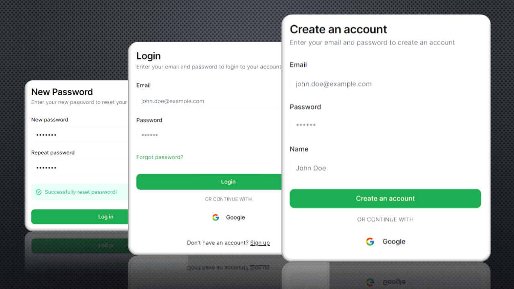

# Introduction



This is a Next.js App Router template for authentication built with Auth.js (formerly NextAuth), Prisma, Resend and Shadcn UI components. It includes:
* Google sign in
* Email and password sign in
* Email verification
* Reset password
* Middleware for protecting routes
* Reusable and customizable components, hooks, server actions, database schemas, utility functions and more!

The project was built using TypeScript and modern Next.js features.

# Installation

Use a package manager to install the necessary dependencies:
```bash
npm install
```

# Google Sign In

To enable Google sign in, go to the Google Cloud Platform Console, create an OAuth 2.0 project and obtain the web client ID and client secret. Add them to your .env file. 

More information here: https://support.google.com/cloud/answer/6158849?hl=en
```bash
GOOGLE_CLIENT_ID=<your-google-client-id>
GOOGLE_CLIENT_SECRET=<your-google-client-secret>
```

# Resend Emails

To enable Resend emails, go to https://resend.com, set up an account and create a new API Key. Add it to your .env file.
```bash
RESEND_API_KEY=<your-resend-api-key>
```

# Database

Get a database url either from a hosted provider or a local instance. Add it to your .env file.
```bash
DATABASE_URL=<your-database-url>
```

# Other Variables

Add an auth secret variable to your .env file and the base url of your application (localhost:3000 for development).
```bash
AUTH_SECRET=<your-auth-secret>
NEXT_PUBLIC_BASE_URL=<your-base-url>
```

To generate an auth secret, you can use the following command:
```bash
openssl rand -base64 33
```


